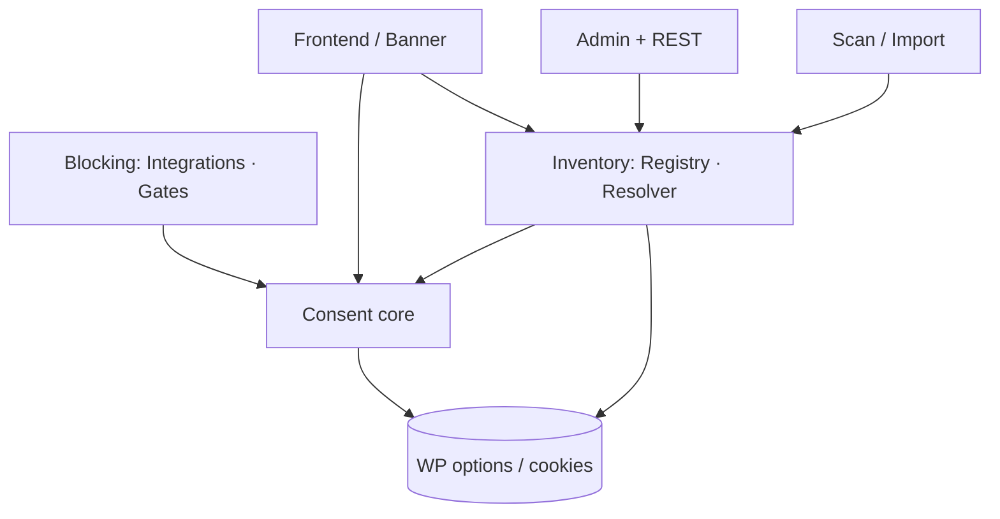

# Kjeks architecture

Current-state map of the Kjeks cookie-consent plugin for WordPress Multisite.
Paths are repository-relative; symbols are exact. Domain terms are defined in
[CONTEXT.md](../CONTEXT.md); decisions and their rationale live in
[docs/adr/](adr). This document describes **implemented** behavior only.

## 1. What it does

Kjeks manages consent for cookies and similar client technologies across a
WordPress network. It blocks non-essential trackers until a visitor consents,
renders an accessible banner, aggregates discovered trackers into a
network-wide registry an admin reviews once, and generates a cookie declaration
from the reviewed set.

**Non-goals (explicit):**

- It does not claim or guarantee legal compliance.
- It does not store server-side consent records (see
  [ADR-0001](adr/0001-client-side-consent-storage.md)).
- The discovery scanner is observational; it cannot prove the absence of
  tracking.

## 2. Actors and external systems

| Actor | Interacts via |
| --- | --- |
| Site visitor | Consent banner + declaration (frontend) |
| Site administrator | Settings → Cookie Consent (per-site review, read-only for network cookies) |
| Network administrator | Network Admin → Cookie Consent (aggregated review) |
| Integration developer | Public PHP API in [src/functions.php](../src/functions.php) + client events |
| CI (GitHub Action) | Scanner + REST `scan-config` / `import` |
| `kjeks-google` add-on | Public API + `window.kjeks` events (separate plugin) |

## 3. Bootstrap and wiring

Entry point [kjeks.php](../kjeks.php) defines constants, loads the Composer
autoloader, registers activation/deactivation to
`Soderlind\Kjeks\Lifecycle\Activation`, and on `plugins_loaded` calls
`Plugin::instance()->boot()`.

[src/Plugin.php](../src/Plugin.php) `boot()` wires every subsystem:

| Wired | Path | Context |
| --- | --- | --- |
| `SiteInitializer` | src/Lifecycle/SiteInitializer.php | always |
| `SettingsController` | src/Rest/SettingsController.php | always (REST) |
| `ImportController` | src/Rest/ImportController.php | always (REST) |
| `ScanConfigController` | src/Rest/ScanConfigController.php | always (REST) |
| `NetworkConfigController` | src/Rest/NetworkConfigController.php | always (REST) |
| `ScriptGate` | src/Blocking/ScriptGate.php | always |
| `Banner` | src/Frontend/Banner.php | always |
| `SiteSettings`, `NetworkAdmin` | src/Admin/ | `is_admin()` |
| `Command` | src/Cli/Command.php | `WP_CLI` — `kjeks import`, `kjeks scan-config` |

`boot()` fires `do_action( 'kjeks_register_integrations' )` on `init` so
integrations register through the public API.

## 4. Components and responsibilities

### Consent core — `src/Consent/`

| Module | Responsibility |
| --- | --- |
| `Categories` | The four canonical categories + `kjeks_categories` filter; `necessary` locked |
| `ConsentSchema` | Wire format of the consent record (`{v,t,b,c}`), shared with the scanner |
| `ConsentState` | Read-only server-side view of the current request's consent (reads the cookie) |
| `PolicyVersion` | Per-site version integer; bumping invalidates prior consent |

### Inventory — `src/Inventory/`

| Module | Responsibility |
| --- | --- |
| `Tracker` | Immutable tracker value object (name, category, party, `sites`, `reviewed`, …) |
| `TrackerIdentity` | The single rule for "same cookie" (name + storage type + domain) |
| `TrackerRegistry` | Network-wide **Registry**: definitions + aggregated discoveries (`kjeks_network_trackers`) |
| `NetworkStore` | Network banner content + uninstall setting (not trackers) |
| `SiteStore` | One site's local trackers + content overrides |
| `InventoryResolver` | Resolves the effective per-site **Inventory** = site-scoped registry + local trackers |

### Blocking — `src/Blocking/` and `src/functions.php`

| Module | Responsibility |
| --- | --- |
| `IntegrationRegistry` / `Integration` | Registry of consent integrations and their gated scripts |
| `ScriptGate` | Emits gated scripts inert (`type="text/plain"`); activates client-side |
| `EmbedGate` | Renders accessible, consent-gated embed placeholders |
| `functions.php` | Public API: `kjeks_register_integration`, `kjeks_enqueue_script`, `kjeks_add_inline_script`, `kjeks_embed`, `kjeks_is_granted`, `kjeks_preferences_link` |

### Frontend — `src/Frontend/` + `assets/src/`

| Module | Responsibility |
| --- | --- |
| `Banner` | Localizes `kjeksConfig`, renders `#kjeks-root`, registers shortcodes/blocks |
| `ContentResolver` | Merges network + site banner content |
| `CookieDeclaration` | Renders the declaration table from the reviewed Inventory |
| `assets/src/banner.js` | Client runtime: consent record, banner + tabbed dialog, gating activation |

### Admin — `src/Admin/` + `assets/src/admin/`

| Module | Responsibility |
| --- | --- |
| `SiteSettings` + `admin/index.js` | Per-site review (network cookies read-only, local editable) |
| `NetworkAdmin` + `admin/network.js` | Aggregated review table: search, filter, bulk review |

### REST — `src/Rest/`

| Route | Controller | Capability |
| --- | --- | --- |
| `GET/POST /kjeks/v1/site-config` | `SettingsController` | `manage_options` |
| `GET/POST /kjeks/v1/network-config` | `NetworkConfigController` | `manage_network` |
| `POST /kjeks/v1/import` | `ImportController` | `manage_network` |
| `GET /kjeks/v1/scan-config` | `ScanConfigController` | `manage_network` |

### Discovery — `src/Scan/`, `src/Cli/` (+ external scanner)

| Module | Responsibility |
| --- | --- |
| `ScanConfig` | Builds the scanner site list (shared by CLI + REST) |
| `ScanValidator` | Validates untrusted scan payloads into unreviewed `Tracker`s |
| `ScanImporter` | Aggregates observations into the `TrackerRegistry` |
| `Cli/Command` | `wp kjeks import`, `wp kjeks scan-config` |
| [kjeks-scanner](https://github.com/soderlind/kjeks-scanner) | Standalone Playwright scanner (separate repo) — **not loaded by WordPress** |

### Lifecycle — `src/Lifecycle/`

| Module | Responsibility |
| --- | --- |
| `Activation` | Network activation seeding (no per-site copy) |
| `SiteInitializer` | `wp_initialize_site` → inherit-at-read defaults |
| `Uninstall` | Deletes data only when the network opt-in is set |

## 5. Dependency direction

Rule: the Consent core and Inventory do not depend on Admin, REST, or Frontend.
Controllers and the frontend are thin adapters over `InventoryResolver` and the
public API.

## 6. Key flows

### 6a. Consent decision and gating (frontend)

1. `Banner::enqueue()` localizes `kjeksConfig` (categories, policy version, blog
   id, reviewed declaration) and enqueues `build/banner.js`.
2. `ScriptGate` emits every gated script inert (`type="text/plain"
   data-kjeks-category`) via `script_loader_tag` and `wp_footer`
   ([ADR-0003](adr/0003-client-side-gating.md)).
3. `banner.js` reads the `kjeks_consent` cookie/localStorage. No valid,
   current-version record ⇒ show the banner; optional categories denied.
4. On a choice it writes the client-side record (host-scoped cookie,
   [ADR-0002](adr/0002-host-scoped-consent.md)) and **activates** inert scripts
   and embeds for granted categories, dispatching `kjeks:granted` /
   `kjeks:withdrawn`.
5. Bumping `PolicyVersion` or GPC (`navigator.globalPrivacyControl`) changes step
   3's outcome.

The consent record is **client-owned**; the server only ever reads it
(`ConsentState`).

### 6b. Discovery → review → declaration

1. The [scanner](https://github.com/soderlind/kjeks-scanner) drives real Chromium across consent states
   ([ADR-0005](adr/0005-scanner-uses-real-chromium.md)) and writes deterministic
   per-site JSON.
2. Import (`POST /kjeks/v1/import` or `wp kjeks import`) →
   `ScanValidator` → `ScanImporter::import()` →
   `TrackerRegistry::merge_observations()`. Observations aggregate by
   `TrackerIdentity`; each records the `blog_id` in its `sites` list and stays
   **unreviewed**.
3. Network admin classifies each once (`NetworkConfigController` bulk review).
4. `InventoryResolver::scoped_network_trackers()` exposes the site-scoped set;
   `reviewed()` filters to reviewed; `CookieDeclaration` and `banner.js` render
   only those.

## 7. Boundaries and invariants

| Invariant | Enforced in | Verified by |
| --- | --- | --- |
| Nothing is auto-classified `necessary` | `Tracker::from_array` (falls back to `marketing`), `ScanValidator` (ignores incoming category) | tests/Unit/TrackerTest.php, tests/Unit/ScanTest.php |
| Only reviewed trackers are public | `InventoryResolver::reviewed()` | tests/Unit/InventoryResolverTest.php |
| Network review is authoritative; site cannot override | `SettingsController::get_config` marks `locked`; resolver has no override path | tests/Unit/InventoryResolverTest.php ("serves a reviewed network tracker as-is") |
| A cookie appears only where observed | `InventoryResolver::scoped_network_trackers()` | tests/Unit/InventoryResolverTest.php ("scopes … only the sites where observed") |
| Same cookie aggregates once | `TrackerIdentity::for` + `TrackerRegistry::merge_observations` | tests/Unit/ScanTest.php ("collapses the same cookie") |
| Non-essential code stays inert pre-consent | `ScriptGate`, `EmbedGate`; client activation | kjeks-scanner: tests/no-tracking-before-consent.spec.js |
| Consent stored client-side only | `ConsentState` (read-only), no write path | [ADR-0001](adr/0001-client-side-consent-storage.md) |
| Uninstall never deletes data without opt-in | `Lifecycle/Uninstall::run()` | — |

Prohibited: the Inventory/Consent core must not depend on Admin/REST/Frontend;
the scanner must not be loaded by the WordPress runtime.

## 8. Where common changes go

| Change | Files |
| --- | --- |
| Add an optional category | `kjeks_categories` filter (consumes `Categories::all()`) |
| Register a gated integration | `kjeks_register_integration()` in a `kjeks_register_integrations` handler; see [examples/](../examples) |
| Change banner/dialog UI | assets/src/banner.js, assets/src/banner.css → `npm run build` |
| Change review UI | assets/src/admin/network.js or index.js → `npm run build` |
| Add a REST field | the relevant `src/Rest/*Controller.php` |
| Change what the scanner collects | [kjeks-scanner](https://github.com/soderlind/kjeks-scanner): src/collect.js, src/scan.js |
| Add a WP-CLI subcommand | `src/Cli/Command.php` + registration in `src/Plugin.php` |

## 9. Related plugin: kjeks-google

`kjeks-google` (separate repo) is an **adapter over the public API** — no direct
dependency on Kjeks internals. It sets Google Consent Mode v2 signals to denied,
registers the GTM/GA container as an inert integration via
`kjeks_register_integration`, and updates signals on the `kjeks:granted` /
`kjeks:withdrawn` client events. Resolution logic lives in its own
`GoogleTagConfig` module.

## 10. Open questions / unknowns

- No integration tests run against a real multisite; unit tests mock WordPress
  via Brain Monkey. Behavior is verified manually against a Local site.
- `kjeks_site_overrides` may remain in old installs; it is listed for cleanup in
  `Lifecycle/Uninstall` but is no longer read.
